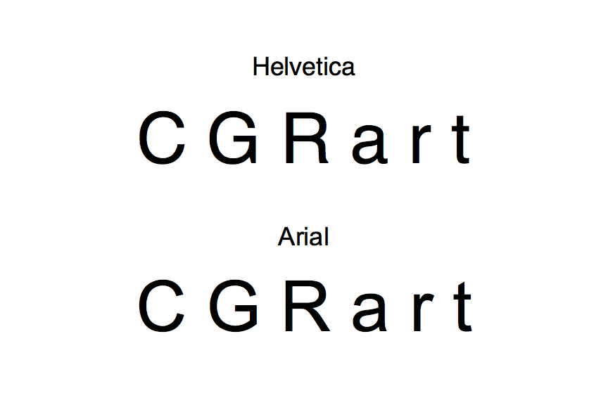
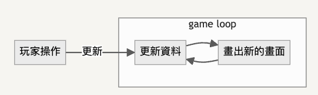

# 7/3 下午

> 重點：  
> 製作遊戲基本架構

## 目錄
- [7/3 下午](#73-下午)
  - [目錄](#目錄)
  - [認識Canvas](#認識canvas)
    - [Canvas 基本架構](#canvas-基本架構)
  - [使用Canvas繪製方形](#使用canvas繪製方形)
  - [使用Canvas繪製路徑](#使用canvas繪製路徑)
  - [使用Canvas繪製弧形](#使用canvas繪製弧形)
  - [改變繪圖顏色](#改變繪圖顏色)
  - [使用Canvas繪製影像](#使用canvas繪製影像)
  - [製作遊戲要用的 HTML、CSS](#製作遊戲要用的-htmlcss)
  - [鍵盤與滑鼠控制](#鍵盤與滑鼠控制)
  - [製作課程目標需要知道的 JS 觀念](#製作課程目標需要知道的-js-觀念)
  - [在邏輯層面寫出遊戲雛形](#在邏輯層面寫出遊戲雛形)

## 認識Canvas

上午我們已經學了html、css與js的基本知識，現在讓我們進一步學習canvas吧。

簡單來說，canvas就是畫布，我們可以使用各種函式在上面繪製想要的圖案。

### Canvas 基本架構

首先，我們在html檔案中建立一個canvas標籤： `<canvas id="canvas" width="150" height="150"></canvas>`

```html
<!doctype html>
<html lang="en-US">
  <head>
    <meta charset="UTF-8" />
    <title>Canvas Test</title>
    <link rel="stylesheet" href="style.css"> <!-- 放你要用的css檔 -->
  </head>
  <body>
    <canvas id="canvas" width="150" height="150"></canvas> <!-- 添加這行 -->
    <script src="script.js"></script> <!-- 放你要用的js檔 -->
  </body>
</html>
```

這段標籤會建立一個150px*150px的畫布，你也可以自己修改大小。

我們可以在css給canvas加上邊框，以更好觀察到它的範圍。當然，早上學習的css程式基本上對canvas也都管用。

```css
canvas {
    border: 1px solid black;
}
```

接著進入你的js檔，貼上這段函式：

```js
function draw() {
    const canvas = document.getElementById("canvas");  // 取得畫布
    if (canvas.getContext) {                           // 確認網站有支援canvas（最好做這一步）
      const ctx = canvas.getContext("2d");             // 規格為2D平面，這行設定的變數名稱將用來呼叫畫布。（設定一次就好）
    }
  }
  draw();
```

這樣一個可以畫畫的畫布就建立完成了，接下來我們會使用函式進行作畫。

## 使用Canvas繪製方形

開始前我們必須先了解canvas的座標計算方法，如圖：


可以看見左上角為原點(0, 0)，分別向右方、下方計算x、y座標與寬、高。

方形是唯一可以直接使用canvas內建函式的圖形，我們就從方形開始認識吧！

繪製方形有三種函式：

- `fillRect(x, y, width, height)` ：畫出一個填滿的方形。
- `strokeRect(x, y, width, height)` ：畫出這個方形的邊框。
- `clearRect(x, y, width, height)` ：清除這個方形範圍內的內容，變為全透明。

將剛才設定的畫布作為前綴寫進draw函式：

```js
const ctx = canvas.getContext("2d");  // 剛剛這行設定的變數名稱，會是下兩行的前綴（此處用ctx，可自行更改）

ctx.fillRect(10, 10, 50, 50);
```

使用這段程式，我們可以看到畫面上出現一個方形。

## 使用Canvas繪製路徑

跟畫畫一樣，canvas有移動筆、下筆的功能，不同的是canvas需要依靠路徑（筆跡）才知道該畫在哪裡。

- `beginPath()`：產生新路徑，下筆前必須呼叫此函式紀錄筆跡。

- `moveTo(X, Y)`：將筆移動到座標(X, Y)，此移動不算筆跡。

- `lineTo(X, Y)`：畫一條直線到座標(X, Y)，此移動會被算進筆跡。

- `closePath()`：可以自動閉合路徑，不一定需要。

- `stroke()`：畫出圖形的邊框（剛剛的筆跡），不會自動閉合。

- `fill()`：填滿路徑內容，會自動閉合路徑並填滿。

例如我們使用這段程式：

```js
const ctx = canvas.getContext("2d");  // 變數名稱ctx可更改

ctx.beginPath();
ctx.moveTo(75, 50);
ctx.lineTo(100, 75);
ctx.lineTo(100, 25);
ctx.fill();
```

就能得到一個填滿的三角形。

但這是因為我們使用了`fill()`，若改為`stroke()`，就會發現筆跡其實是沒有閉合的。

## 使用Canvas繪製弧形

- `arc(圓心X, 圓心Y, 半徑, 開始弧度, 結束弧度, 是否逆時針)`

  弧度radians並不是角度degrees。參考換算公式：`radians = (Math.PI/180) * degrees`

```js
const ctx = canvas.getContext("2d");  // 變數名稱ctx可更改

ctx.beginPath();
ctx.arc(75, 75, 50, 0, Math.PI/2, false);
ctx.stroke();
```

這段程式可以畫出圓心在(75, 75)，右下角的1/4圓弧。

另外是貝茲曲線，繪畫規則如圖：


- `quadraticCurveTo(參考點1X, 參考點1Y, X, Y)`：從目前位置，根據參考點1，畫一條二次貝茲曲線到(X, Y)。

- `bezierCurveTo(參考點1X, 參考點1Y, 參考點2X, 參考點2Y, X, Y)`：從目前位置，根據參考點1、2，畫一條三次貝茲曲線到(X, Y)。

```js
var ctx = canvas.getContext("2d");

ctx.beginPath();
ctx.moveTo(75, 40);
ctx.bezierCurveTo(75, 37, 70, 25, 50, 25);
ctx.bezierCurveTo(20, 25, 20, 62.5, 20, 62.5);
ctx.bezierCurveTo(20, 80, 40, 102, 75, 120);
ctx.bezierCurveTo(110, 102, 130, 80, 130, 62.5);
ctx.bezierCurveTo(130, 62.5, 130, 25, 100, 25);
ctx.bezierCurveTo(85, 25, 75, 37, 75, 40);
ctx.fill();
```
這段程式可以畫一顆愛心。

## 改變繪圖顏色

- `strokeStyle = 顏色`：改變畫出的邊框的顏色。

- `fillStyle = 顏色`：改變填滿的顏色。

[漸變顏色的做法可以參考這個網站。](https://developer.mozilla.org/zh-TW/docs/Web/API/Canvas_API/Tutorial/Applying_styles_and_colors)


## 使用Canvas繪製影像

- `drawImage(圖片, X, Y, 寬, 高)`：以座標(X, Y)為圖片右上角，畫出寬、高的圖片

範例程式：
```js
function draw() {
    const ctx = document.getElementById("canvas").getContext("2d");
    const img = new Image();
    img.onload = () => {
      ctx.drawImage(img, 20, 20, 60, 40);
    };
    img.src = "https://cdn.vox-cdn.com/uploads/chorus_asset/file/22312759/rickroll_4k.jpg";
}  
draw();
```
- `drawImage(圖片, 切割起點X, 切割起點Y, 切割寬, 切割高, X, Y, 寬, 高)`：

  可以切割圖片的寫法，前面設定如何切割圖片，後面與前一條程式相同。

*參考資料：[Canvas教學文件](https://developer.mozilla.org/zh-TW/docs/Web/API/Canvas_API/Tutorial)*

<hr>

## 製作遊戲要用的 HTML、CSS

既然我們已經學會了那麼多技能，那麼是時候來製作遊戲了對吧！  
以下是我們這次預計製作的內容：[https://coding-impact.github.io/EvilWizard/](https://coding-impact.github.io/EvilWizard/)  
Repository：[https://coding-impact.github.io/EvilWizard/](https://coding-impact.github.io/EvilWizard/)  

如果覺得很難的話，不用太擔心，這篇教學將會手把手帶你完成。如果覺得太簡單的話，也歡迎自己添加任何更酷炫的內容。

- 打開隨便一個空資料夾，用 vscode 打開它。
- 建立一個檔案，叫做index.html，輸入以下內容

```html
<!DOCTYPE html>
<html>
<head>
    <title>Epic Game</title>
    <style>
        body,
        html {
            background-color: #121212;
            color: #eeeeee;
            font-family: "Helvetica", "Arial","LiHei Pro","黑體-繁","微軟正黑體", sans-serif;  /* 我個人常用的字型組合 */
        }
        h2 {
            margin-top: 0;
        }
      
        .app {
            display: flex;
            justify-content: center;
        }
        .container {
            max-width: 900px;
            margin: 8px;
            padding: 16px;
            width: 900px;
            border: 4px solid #202020;
        }
    </style>
</head>
<body>
    <div class="app">
        <div class="container">
            <h2>epic cool game</h1>
            <p>not very cool, but stil very cool</p>
        </div>
    </div>
</body>
</html>
```

當中，需要特別注意的是

```css
.container {
    max-width: 900px;
    margin: 8px;
    padding: 16px;
    width: 900px;
    border: 4px solid #202020;
}
```

`.container`中的`max-width`在寬度超過`900px`時將寬度設置為`900px`，`width`在寬度少於`900px`時盡可能拉寬元素。

關於字型，Helvetica 和 Arial 的差別可以看下圖。



## 鍵盤與滑鼠控制

- 在 `index.html` 的旁邊建立一個資料夾：`js`，再在裡面建立一個檔案：`index.js`，這將會是我們操控 `canvas` 元素的程式碼擺放的位置，不過他目前的用處將會是讓我們展示如何監聽鍵盤與滑鼠事件。

在 `index.html` 中添加引入 `index.js` 的部分，如下：

```html
<!-- 前後省略 -->
<head>
    <script type="module" src="js/index.js"></script>  <!-- 添加這行 -->
    <title>Epic Game</title>
<!-- 前後省略 -->
```

在 `div` 元素裡面放入 `canvas` 元素，如下：

```html
<!-- 前後省略 -->
<div class="container">
    <h2>epic cool game</h1>
    <p>not very cool, but stil very cool</p>
    <canvas id="gameCanvas" style="background-color: #ffffff;"></canvas>
</div>
<!-- 前後省略 -->
```

記得要設定 `id`，這樣之後在程式碼中才能夠找到他，而設定背景顏色，則是為了方便知道畫布元素的大小。
如果你不想要設定畫布顏色來知道畫布範圍的話，也可以打開偵錯工具的元件分頁，找到這個元素的位置，或通常按右鍵，選檢查，就能看到他的範圍。

在 `index.js` 裡面填入以下內容：

```js

const canvas = document.getElementById('gameCanvas');

document.addEventListener('keydown', function(event) {
    console.log(`key down" ${event.code}`);
});

document.addEventListener('keyup', function(event) {
    console.log(`key up" ${event.code}`);
  
});

canvas.addEventListener('mouseleave', () => {
    console.log(`mouse leave`);
});

canvas.addEventListener('mouseenter', () => {
    console.log(`mouse enter`);
});

canvas.addEventListener('mousemove', function(event) {
    console.log(`mouse move: ${event.clientX} ${event.clientY}`);
});

```

完成後，回到網頁，打開網頁主控台。測試滑鼠進出 `canvas`、滑鼠移動、鍵盤按鍵按下與鬆開有沒有出現對應紀錄。  

如果都沒有問題，那就代表非常好，我們理論上，是可以做出這個遊戲的，至少需要的技術（讀取玩家輸入、渲染畫面）我們現在都有了，所以剩下的就是單純的程式了。

如果你做的都沒問題，應該要看起來像這樣：


[DEMO](https://coding-impact.github.io/saves/complete_html/)  
[目前原始碼](https://github.com/coding-impact/coding-impact.github.io/blob/main/saves/complete_html/)  

## 製作課程目標需要知道的 JS 觀念

如果從資料產生的方式來分析的話（簡稱資料流），我們預計做的遊戲的結構會是這樣的：  

  

當中，玩家的滑鼠會移動角色的準心，按鍵操控角色方向，與發射。  
更新資料包含了計算鏡頭移動、所有實體被看到的正確的型態、敵人行動等。  
畫出新的畫面（簡稱渲染）包含了畫背景、畫所有實體、畫血條、畫文字等。  

我們會採用物件導向，和 [Entity Component System](https://en.wikipedia.org/wiki/Entity_component_system) 的方式來寫，整個遊戲引擎都包含在內。

為什麼要使用物件導向？未完待補

為什麼要使用 Entity Component System？未完待補

而啟動遊戲開發可以分成三步：

1. 先在邏輯層面寫出遊戲雛形
2. 接到畫面上
3. 持續完善

## 在邏輯層面寫出遊戲雛形

想要在落籍層面上寫出遊戲雛形，那麼我們得清楚我們想要寫的是什麼。  

我們會希望整個遊戲的架構是這樣的

```js
function gameLoop() {
    update();
    render();
}
```

而當中 `update` 和 `render` 實際上都會是圍繞著一堆描述遊戲目前狀態的數據。為了方便起見，我們目前就先只思考遊戲中主要會出現的東西，也就是實體。我這邊把所有遊戲中會出現的物件，並且要渲染到畫面上，以遊戲世界座標為定位的東西稱為「實體」，實體只會描述實體們共通的基礎行為，如果需要更複雜的行為，例如之後會出現「粒子」，就可以繼承這個實體類別，定義一個粒子類別。  

所以我們就先來設計這個實體（Entity）吧！  

```js
import {Vector} from './utils.js';

class Entity {
  constructor(x, y) {
    this.pos = new Vector(x, y);
  }
  update() {
    // 每次更新要執行的函式
  }
  render() {
    // 每次繪製要執行的函式
  }
};
```

這時候你會發現，上面提到了一個新東西，叫做 Vector，這是一個類別，可以處理各種向量操作，請下載下來後，確定他的名字是 utils.js，並放到 index.js 旁邊。  

[查看 utils.js](https://github.com/coding-impact/coding-impact.github.io/blob/main/saves/only_vector/utils.js)  

目前裡面只會包含 Vector 相關的程式碼，在未來，這邊還會新增更多程式。  

> utils 的意思：  
> utils 是 utilities 的縮寫，意思是「實用工具們」

那，有實體了，我們要如何在 update() 函數裡面更新 Entity 的狀態呢？  
未來我們會寫另外一個物件來做這件事情，但目前我們可以先用列表代替。
當我們想要新增實體時，就把實體加進去這個列表就好了。

```js
let entityList = [];
function update(){
    for (let i = 0; i < entityList.length; i++) {
        entityList[i].update();
    }
}
function render(){
    for (let i = 0; i < entityList.length; i++) {
        entityList[i].render();
    }
}

function gameLoop() {
    update();
    render();
}
```
